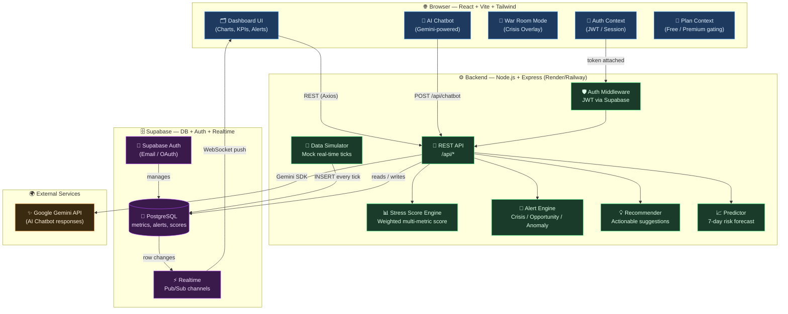
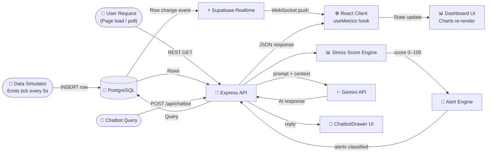

# OpsPulse ⚡
### Real-Time Business Health Monitoring & Crisis Management (SaaS)

OpsPulse is a high-performance business intelligence platform designed for Small and Medium-sized Businesses (SMBs). It unifies fragmented data from sales, inventory, and operations into a single, high-fidelity dashboard. With its intelligent **Business Stress Score**, OpsPulse provides actionable insights, automated crisis alerts, and an AI-powered War Room mode to help owners make data-driven decisions in real-time.

---


## 🚀 Key Features

- **Live Business Stress Score**: A real-time proprietary algorithm that calculates your business health from 0 to 100.
- **Intelligent Alert System**: Automatically detects revenue drops, inventory stockouts, and customer support anomalies.
- **War Room Mode**: A high-intensity UI environment triggered during business crises to focus on immediate recovery actions.
- **AI Chatbot Assistant**: Powered by Google Gemini, providing strategic advice based on your current business metrics.
- **Role-Based Views**: Tailored dashboards for both Business Owners and Operations Managers.
- **Predictive Risk Trends**: Extrapolates current trends to forecast potential risks in the next 7 days.

---

# 📡 OpsPulse — Unified Business Health Dashboard

**OpsPulse** is a real-time, web-based analytics engine designed to eliminate data silos for Small and Medium-sized Businesses (SMBs). By aggregating fragmented data from sales, inventory, and support, OpsPulse provides founders and managers with a singular, actionable pulse on their operational health.

---

## 🚀 Core Features

### 🧠 1. Business Stress Score (BSS)
A dynamically computed metric derived from a weighted formula across three business verticals. The BSS acts as a "Check Engine" light for the entire company, recalculating in real-time as data streams in.

### 🚨 2. Three-Tier Intelligent Alerts
Our system categorizes signals to prevent dashboard fatigue:
* **Crisis Alerts:** Immediate threats requiring the "War Room."
* **Opportunity Signals:** Positive trends (e.g., sudden sales spikes).
* **Anomaly Flags:** Unusual patterns that require investigation.

### 👥 3. Dual-Role Interface
* **Business Owner View:** High-level KPIs, cash flow health, and long-term trends.
* **Operations Manager View:** Granular logistics, ticket volumes, and inventory turnover.

### 🔴 4. War Room Mode
When a crisis is detected (BSS > Threshold), the UI transforms. All non-essential data is stripped away, surfacing only the most critical, actionable metrics to resolve the simulation crisis.

---
## System Architecture

OpsPulse follows a **three-tier architecture**: a React SPA on the frontend, a Node.js/Express REST + WebSocket backend, and Supabase as the managed backend-as-a-service layer. Real-time updates flow from Supabase Realtime directly to the browser, bypassing the REST API for low-latency reads.

### High-Level Architecture Overview



---

## 🛠️ Tech Stack

* **Frontend:** Next.js 14 (App Router), Tailwind CSS, Shadcn/UI
* **Charts:** Tremor & Recharts
* **Real-time Engine:** Socket.io / Supabase Realtime
* **Backend:** Node.js (TypeScript)
* **Database:** PostgreSQL (Supabase)

---

### Data Pipeline Flow

This diagram shows the end-to-end request/data lifecycle — from data generation to rendering on screen.



---

## 📉 The Stress Score Formula

The **Business Stress Score ($S$)** is calculated using the following business-justified weighted formula:

$$S = \sum_{i=1}^{n} (w_i \cdot V_i)$$

Where:
* $V_1$ = **Sales Velocity** (inverted)
* $V_2$ = **Inventory Stock-out Risk**
* $V_3$ = **Support Ticket Backlog**
* $w$ = **Weighting factors** (assigned based on business impact)

> **Note:** A detailed one-page justification of this logic is included in the `/docs` folder for the judging panel.

---

## 🛠️ Project Structure

### Backend (`/backend`)
- `engines/` — Proprietary logic for Stress Scoring, Alerts, and Recommendations.
- `routes/` — API endpoints for metrics, chatbot, and system status.
- `simulators/` — Real-time mock data generator for demonstration.
- `server.js` — Express server with WebSocket integration for real-time updates.

### Frontend (`/frontend`)
- `components/` — Modularized UI library (Gauges, Charts, Alert Panels).
- `hooks/` — Custom hooks for real-time data polling and state management.
- `pages/` — Dedicated dashboards for Owner and Operations roles.
- `context/` — Global state for authentication and feature gating.

---

## 📊 Stress Score Algorithm

The Business Stress Score is calculated using a weighted average of critical KPIs:

```
Stress Score (0–100) =
  0.40 × Sales Decline Index
  0.30 × Inventory Risk Index
  0.20 × Support Complaint Index
  0.10 × Cash Flow Instability
```

### Thresholds:
- **0–30: Healthy 🟢** — Business is operating within optimal parameters.
- **31–59: Caution 🟡** — Minor inefficiencies detected.
- **60–79: Warning 🟠** — Performance is degrading; intervention suggested.
- **80–100: Crisis 🔴** — **War Room Activated**. Immediate action required.

---

## 💎 SaaS Pricing & Tiers

| Feature | Free | Premium ($29/mo) |
|---------|------|-----------------|
| Dashboard views | Owner only | Owner + Ops Manager |
| Data history | 24 hours | 90 days |
| Stress Score | Basic | Full breakdown + trend |
| Alerts | Simple | Crisis + Opportunity + Anomaly |
| War Room Mode | ❌ | ✅ |
| AI Chatbot | ❌ | ✅ |
| Predictive Risk | ❌ | ✅ |

---
 
## 🏁 Getting Started

### 1. Prerequisites
- Node.js (v18+)
- npm / yarn

### 2. Installation
```bash
# Clone the repository
git clone https://github.com/your-username/opspulse.git

# Install Backend dependencies
cd backend && npm install

# Install Frontend dependencies
cd ../frontend && npm install
```

### 3. Running Locally
```bash
# Start Backend
cd backend && npm run dev

# Start Frontend (in a new terminal)
cd frontend && npm run dev
```

---

## 🛡️ Verification
The system can be verified by triggering simulator ticks via API:
- `GET /api/stress-score` — View current business health.
- `POST /api/simulate/tick` — Advance data and watch the UI react.
