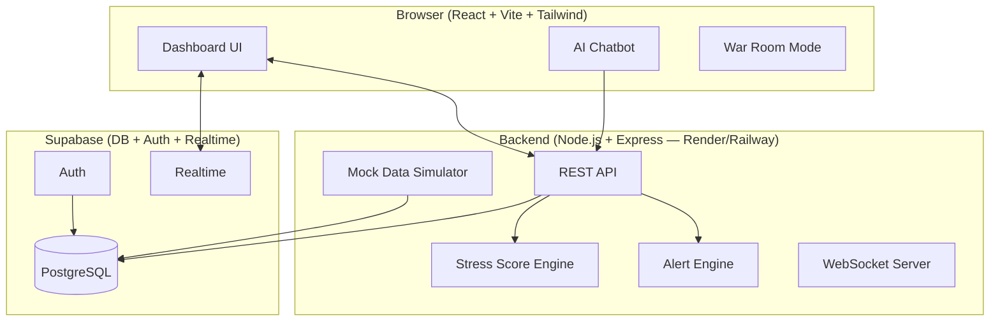

# OpsPulse — Implementation Plan
## Business Health Monitoring Dashboard (SaaS)

OpsPulse is a real-time business intelligence SaaS platform for SMBs that unifies sales, inventory, customer support, and cash-flow data into a single dashboard with an intelligent **Business Stress Score**, an alert system, War Room mode, and an AI chatbot assistant.

---

## System Architecture



---

## Proposed Changes

### Backend — `hachkathon-project/backend/`

#### [NEW] `backend/` — Express API server

**Files:**
- `server.js` — Entry point, Express app, WebSocket server
- `routes/metrics.js` — Metrics API endpoints
- `routes/alerts.js` — Alert retrieval and management
- `routes/chatbot.js` — AI chatbot endpoint powered by **Google Gemini API (free tier)** via `@google/generative-ai`
- `routes/auth.js` — Supabase auth passthrough
- `engines/stressScore.js` — Business Stress Score algorithm
- `engines/alertEngine.js` — Alert classification logic
- `engines/recommender.js` — Decision Recommendation Engine
- `engines/predictor.js` — Predictive risk trend extrapolation
- `simulators/dataGenerator.js` — Mock real-time data streams
- `middleware/auth.js` — JWT verification via Supabase
- `supabase/schema.sql` — Full DB schema for Supabase
- `package.json`, `.env.example`

**Key API Endpoints:**

| Method | Path | Description |
|--------|------|-------------|
| GET | `/api/metrics/sales` | Sales data (last N intervals) |
| GET | `/api/metrics/inventory` | Inventory levels |
| GET | `/api/metrics/support` | Support ticket stats |
| GET | `/api/metrics/cashflow` | Cash flow metrics |
| GET | `/api/stress-score` | Current stress score + breakdown |
| GET | `/api/alerts` | Current alerts (crisis/opportunity/anomaly) |
| POST | `/api/chatbot` | AI chatbot query |
| GET | `/api/recommendations` | Action recommendations |
| GET | `/api/predictions` | 7-day risk forecast |
| POST | `/api/simulate/tick` | Advance mock data by one tick |
| GET | `/api/plan` | User plan info (free/premium) |

---

### Frontend — `hachkathon-project/frontend/`

#### [NEW] `frontend/` — React + Vite + Tailwind app

**Component structure:**

```
src/
├── main.jsx
├── App.jsx
├── index.css                  # Tailwind + custom design tokens
├── lib/
│   ├── supabase.js            # Supabase client
│   ├── api.js                 # Axios API wrapper
│   └── utils.js               # Helpers
├── hooks/
│   ├── useMetrics.js          # Polling / realtime hook
│   ├── useStressScore.js
│   └── useAlerts.js
├── components/
│   ├── layout/
│   │   ├── Sidebar.jsx
│   │   ├── Navbar.jsx
│   │   └── Layout.jsx
│   ├── dashboard/
│   │   ├── StressScoreGauge.jsx   # Animated arc gauge
│   │   ├── SalesChart.jsx         # Recharts line chart
│   │   ├── InventoryChart.jsx     # Bar chart
│   │   ├── CashFlowChart.jsx      # Area chart
│   │   ├── SupportTicketCard.jsx  # Stat card
│   │   ├── MetricCard.jsx         # Reusable KPI card
│   │   └── AlertPanel.jsx         # Crisis/Opportunity/Anomaly
│   ├── warroom/
│   │   └── WarRoomOverlay.jsx     # Full-screen crisis mode
│   ├── chatbot/
│   │   └── ChatbotDrawer.jsx      # Slide-in chat panel
│   ├── recommendations/
│   │   └── RecommendationFeed.jsx
│   └── auth/
│       ├── LoginPage.jsx
│       └── RegisterPage.jsx
├── pages/
│   ├── OwnerDashboard.jsx         # Business Owner view
│   ├── OperationsDashboard.jsx    # Operations Manager view
│   ├── WarRoom.jsx
│   ├── Pricing.jsx
│   └── Auth.jsx
└── context/
    ├── AuthContext.jsx
    └── PlanContext.jsx            # Free/Premium gating
```

---

## Database Schema (Supabase PostgreSQL)

```sql
-- Users table extended from Supabase Auth
create table public.profiles (
  id uuid references auth.users primary key,
  plan text default 'free',        -- 'free' | 'premium'
  business_name text,
  created_at timestamptz default now()
);

-- Sales metrics (simulated ticks)
create table public.sales_metrics (
  id bigserial primary key,
  user_id uuid references public.profiles,
  revenue numeric,
  orders int,
  refunds int,
  recorded_at timestamptz default now()
);

-- Inventory metrics
create table public.inventory_metrics (
  id bigserial primary key,
  user_id uuid references public.profiles,
  product_name text,
  stock_level int,
  reorder_threshold int,
  recorded_at timestamptz default now()
);

-- Support tickets
create table public.support_metrics (
  id bigserial primary key,
  user_id uuid references public.profiles,
  open_tickets int,
  resolved_tickets int,
  avg_response_hours numeric,
  recorded_at timestamptz default now()
);

-- Cash flow
create table public.cashflow_metrics (
  id bigserial primary key,
  user_id uuid references public.profiles,
  inflow numeric,
  outflow numeric,
  balance numeric,
  recorded_at timestamptz default now()
);

-- Stress score history
create table public.stress_scores (
  id bigserial primary key,
  user_id uuid references public.profiles,
  score numeric,
  sales_component numeric,
  inventory_component numeric,
  support_component numeric,
  cashflow_component numeric,
  recorded_at timestamptz default now()
);

-- Alerts
create table public.alerts (
  id bigserial primary key,
  user_id uuid references public.profiles,
  type text,          -- 'crisis' | 'opportunity' | 'anomaly'
  title text,
  message text,
  severity text,      -- 'low' | 'medium' | 'high' | 'critical'
  is_read boolean default false,
  created_at timestamptz default now()
);
```

---

## Stress Score Algorithm

```
Stress Score (0–100) =
  0.40 × Sales Decline Index      (normalized 0–100)
  0.30 × Inventory Risk Index     (normalized 0–100)
  0.20 × Support Complaint Index  (normalized 0–100)
  0.10 × Cash Flow Instability    (normalized 0–100)
```

**Rationale:**
- **Sales (40%)** — Revenue is the primary business health signal; a steep drop is the fastest indicator of crisis
- **Inventory (30%)** — Stockouts directly block revenue and create compounding support issues
- **Support (20%)** — High complaint volume indicates product/service quality degradation
- **Cash Flow (10%)** — Lagging indicator; short-term cash issues follow operational problems

**Scoring logic per component:**
- Sales Decline: `clamp((baseline_revenue - current_revenue) / baseline_revenue × 100, 0, 100)`
- Inventory Risk: `(items_below_threshold / total_items) × 100`
- Support Index: `clamp(open_tickets / ticket_threshold × 100, 0, 100)`
- Cash Flow: `clamp((outflow - inflow) / max_outflow × 100, 0, 100)`

**Thresholds:**
- 0–30: Healthy 🟢
- 31–59: Caution 🟡
- 60–79: Warning 🟠
- 80–100: Crisis 🔴 → War Room activates

---

## Alert System Logic

| Category | Trigger | Example |
|----------|---------|---------|
| 🔴 Crisis | Score > 80 or individual component > 80 | "Revenue dropped 40% in last hour" |
| 🟡 Opportunity | Positive spike (+20% sales, trending product) | "Product X sales up 35% — consider promotion" |
| 🟠 Anomaly | Unusual variance beyond 2σ from rolling average | "Refund rate 3× higher than normal" |

---

## SaaS Pricing Strategy

| Feature | Free | Premium ($29/mo) |
|---------|------|-----------------|
| Dashboard views | Owner only | Owner + Ops Manager |
| Data history | 24 hours | 90 days |
| Stress Score | Basic | Full breakdown + trend |
| Alerts | Simple | Crisis + Opportunity + Anomaly |
| War Room Mode | ❌ | ✅ |
| AI Chatbot | ❌ | ✅ |
| Recommendations | ❌ | ✅ |
| Predictive Risk | ❌ | ✅ |
| Export Reports | ❌ | ✅ |

---

## Verification Plan

### Dev Server Testing (Automated)
```bash
# Backend
cd backend && npm run dev
# Verify: http://localhost:4000/api/stress-score returns JSON

# Frontend
cd frontend && npm run dev
# Verify: http://localhost:5173 loads dashboard
```

### Browser-Based Visual Testing
- Load Owner Dashboard → verify 4 charts render with mock data
- Verify Stress Score gauge animates correctly
- Trigger War Room by setting score > 80 in simulator
- Test Chatbot sends and receives responses
- Switch between Owner / Ops Manager views
- Verify Free vs Premium plan gating (lock icons on premium features)

### Manual API Testing
```bash
curl http://localhost:4000/api/stress-score
curl http://localhost:4000/api/alerts
curl -X POST http://localhost:4000/api/simulate/tick
```
